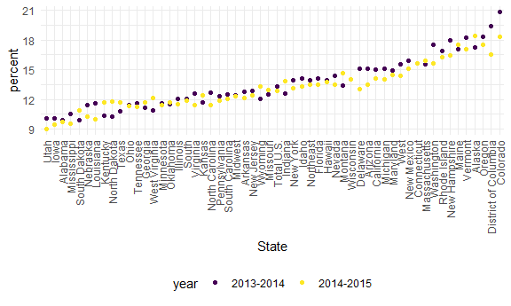
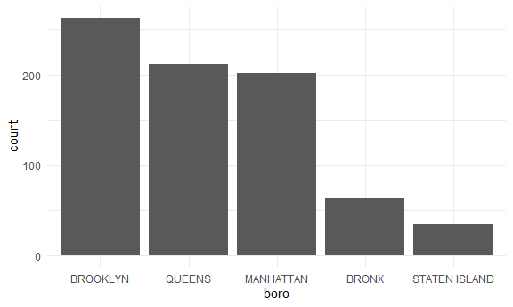

Strings and Factors
================

Viridis

Load the necessary libraries

``` r
library(rvest) #facilitates web scraping
```

    ## 
    ## Attaching package: 'rvest'

    ## The following object is masked from 'package:readr':
    ## 
    ##     guess_encoding

``` r
library(p8105.datasets)
```

## Let’s do strings

``` r
string_vec = c("my", "name", "is", "jeff")

str_detect(string_vec, "jeff") #looking for __ (case sensitive)
```

    ## [1] FALSE FALSE FALSE  TRUE

``` r
str_replace(string_vec, "jeff", "Jeff") #replaces strings that matches "jeff" to "Jeff"
```

    ## [1] "my"   "name" "is"   "Jeff"

``` r
str_replace(string_vec, "e", "E") #replaces strings that matches "e" to "E"
```

    ## [1] "my"   "namE" "is"   "jEff"

``` r
string_vec = c(
  "i think we all rule for participating",
  "i think i have been caught",
  "i think this will be quite fun actually",
  "it will be fun, i think"
  )

str_detect(string_vec, "i think")
```

    ## [1] TRUE TRUE TRUE TRUE

``` r
str_detect(string_vec, "^i think") #to find the str that STARTS with "i think"
```

    ## [1]  TRUE  TRUE  TRUE FALSE

``` r
str_detect(string_vec, "i think$") #to find the str that ENDS with "i think"
```

    ## [1] FALSE FALSE FALSE  TRUE

``` r
string_vec = c(
  "Time for a Pumpkin Spice Latte!",
  "went to the #pumpkinpatch last weekend",
  "Pumpkin Pie is obviously the best pie",
  "SMASHING PUMPKINS -- LIVE IN CONCERT!!"
  )

str_detect(string_vec, "pumpkin")
```

    ## [1] FALSE  TRUE FALSE FALSE

``` r
str_detect(string_vec, "Pumpkin")
```

    ## [1]  TRUE FALSE  TRUE FALSE

``` r
str_detect(string_vec, "PUMPKIN")
```

    ## [1] FALSE FALSE FALSE  TRUE

``` r
str_detect(string_vec,"[Pp]umpkin") #allow multiple options: either "P" or "p" and anything else after that to match "umpkin"
```

    ## [1]  TRUE  TRUE  TRUE FALSE

``` r
string_vec = c(
  '7th inning stretch',
  '1st half soon to begin. Texas won the toss.',
  'she is 5 feet 4 inches tall',
  '3AM - cant sleep :('
  )

#pattern shows a number followed by two letters on three of them

str_detect(string_vec, "[0-9][a-zA-Z]") #give me any number between 0 and 9 and letter a to z and A to Z
```

    ## [1]  TRUE  TRUE FALSE  TRUE

More patterns to detect…

``` r
string_vec = c(
  'Its 7:11 in the evening',
  'want to go to 7-11?',
  'my flight is AA711',
  'NetBios: scanning ip 203.167.114.66'
  )

#pattern: something that matches 7 something 11, can use "." because it will detect anything between 7 and 11

str_detect(string_vec, "7.11")
```

    ## [1]  TRUE  TRUE FALSE  TRUE

How things start to get real strange

``` r
string_vec = c(
  'The CI is [2, 5]',
  ':-]',
  ':-[',
  'I found the answer on pages [6-7]'
  )

#say you're looking for special characters because by themselves there's a special meaning like "["?

str_detect(string_vec, "\\[") # "\" alone is a special character, so need "\\" before the special character you want to look for
```

    ## [1]  TRUE FALSE  TRUE  TRUE

## Factors …

``` r
sex_vec = factor(c("male", "male", "female", "female"))

#this automatically puts female first level alphabetically

as.numeric(sex_vec)
```

    ## [1] 2 2 1 1

do some releveling…

``` r
sex_vec = fct_relevel(sex_vec, "male") #can use relevel function to tell it which comes first

as.numeric(sex_vec)
```

    ## [1] 1 1 2 2

## Revisit a lot of examples

NSDUH

``` r
url = "http://samhda.s3-us-gov-west-1.amazonaws.com/s3fs-public/field-uploads/2k15StateFiles/NSDUHsaeShortTermCHG2015.htm"

drug_use_html = read_html(url)
```

Get the pieces I actually need

``` r
marj_use_df = 
  drug_use_html |> 
  html_table() |> 
  first() |> #takes first element out of the table or first table, can type in command line ?first to see if you can import an nth function to specify other elements
  slice(-1) #subtracts first row
```

Get rid of p value Go from wide to long format Separate age and year Get
rid of parentheses Get rid of abc’s Change percent to numerical format

``` r
marj_use_df = 
  drug_use_html |> 
  html_table() |> 
  first() |> #takes first element out of the table or first table, can type in command line ?first to see if you can import an nth function to specify other elements
  slice(-1) |>  #subtracts first row
  select(-contains("P Value")) |> 
  pivot_longer(
    cols = -State,
    names_to = "age_year",
    values_to = "percent"
  ) |> 
  separate(age_year, into = c("age", "year"), sep = "\\(") |> 
  mutate(
    year = str_replace(year, "\\)", ""), #get rid of ")"
    percent = str_remove(percent, "[a-c]$"), #in the percent variable, remove "[a-c]" to get rid of abc's based on the dataset 
    percent = as.numeric(percent) #convert percent to numeric
  )
```

Plot the proportion of ppl that said “yes” only among kids who are age
12 - 17

``` r
marj_use_df |> 
  filter(age == "12-17") |> 
  mutate(
    State = fct_reorder(State, percent) #reorder State (categorical) using percent (numerical) bc without this the plots are all over the place
  ) |> 
  ggplot(aes(x = State, y = percent, color = year)) +
  geom_point() +
  theme(axis.text.x = element_text(angle = 90, vjust = 0.5, hjust = 1)) #rotate the x-axis names by 90 degrees
```



## NYC Restaurant Inspections

``` r
data("rest_inspec")
```

``` r
rest_inspec |> 
  count(boro, grade) |> 
  pivot_wider(
    names_from = grade,
    values_from = n
  )
```

    ## # A tibble: 6 × 8
    ##   boro              A     B     C `Not Yet Graded`     P     Z  `NA`
    ##   <chr>         <int> <int> <int>            <int> <int> <int> <int>
    ## 1 BRONX         13688  2801   701              200   163   351 16833
    ## 2 BROOKLYN      37449  6651  1684              702   416   977 51930
    ## 3 MANHATTAN     61608 10532  2689              765   508  1237 80615
    ## 4 Missing           4    NA    NA               NA    NA    NA    13
    ## 5 QUEENS        35952  6492  1593              604   331   913 45816
    ## 6 STATEN ISLAND  5215   933   207               85    47   149  6730

Drop “missing” boro and focus only on A-C.

``` r
rest_inspec = 
  rest_inspec |> 
  filter(
    str_detect(grade, "[A-C]"),
    !(boro == "Missing")
  )
```

``` r
rest_inspec |> 
  mutate(dba = str_to_sentence(dba)) |> 
  filter(str_detect(dba, "Pizza")) #look for pizza places
```

    ## # A tibble: 775 × 18
    ##    action          boro  building  camis critical_flag cuisine_description dba  
    ##    <chr>           <chr> <chr>     <int> <chr>         <chr>               <chr>
    ##  1 Violations wer… MANH… 151      5.00e7 Not Critical  Pizza               Pizz…
    ##  2 Violations wer… MANH… 151      5.00e7 Critical      Pizza               Pizz…
    ##  3 Violations wer… MANH… 151      5.00e7 Critical      Pizza               Pizz…
    ##  4 Violations wer… MANH… 15       5.01e7 Critical      Pizza               & Pi…
    ##  5 Violations wer… MANH… 151      5.00e7 Critical      Pizza               Pizz…
    ##  6 Violations wer… MANH… 151      5.00e7 Not Critical  Pizza               Pizz…
    ##  7 Violations wer… MANH… 15       5.01e7 Critical      Pizza               & Pi…
    ##  8 Violations wer… MANH… 151      5.00e7 Critical      Pizza               Pizz…
    ##  9 Violations wer… MANH… 84       5.00e7 Not Critical  Pizza               Pizza
    ## 10 Violations wer… MANH… 525      5.01e7 Not Critical  Pizza               Pizz…
    ## # ℹ 765 more rows
    ## # ℹ 11 more variables: inspection_date <dttm>, inspection_type <chr>,
    ## #   phone <chr>, record_date <dttm>, score <int>, street <chr>,
    ## #   violation_code <chr>, violation_description <chr>, zipcode <int>,
    ## #   grade <chr>, grade_date <dttm>

Which boro has the most pizza places

``` r
rest_inspec |> 
  mutate(dba = str_to_sentence(dba)) |> 
  filter(str_detect(dba, "Pizza")) |> 
  mutate(boro = fct_infreq(boro)) |>  #putting boro (categorical) in the order of which one has the most frequency
  ggplot(aes(x = boro)) +
  geom_bar()
```



Careful…your order of mutate step matters whether you’re doing
str_replace first then fct_infreq or vice versa

``` r
rest_inspec |> 
  mutate(dba = str_to_sentence(dba)) |> 
  filter(str_detect(dba, "Pizza")) |> 
  mutate(
    boro = str_replace(boro, "MANHATTAN", "THE CITY"),
    boro = fct_infreq(boro) 
    )|>  #putting boro (categorical) in the order of which one has the most frequency
  ggplot(aes(x = boro)) +
  geom_bar()
```


One last thing on factors…

``` r
rest_inspec |> 
  mutate(dba = str_to_sentence(dba)) |> 
  filter(str_detect(dba, "Pizza")) |>
  lm(zipcode ~ boro, data = _) #output is four regression coefficients, implicitly defining categorical variable with Bronx as a reference since it is the first in order of alphabet
```

    ## 
    ## Call:
    ## lm(formula = zipcode ~ boro, data = filter(mutate(rest_inspec, 
    ##     dba = str_to_sentence(dba)), str_detect(dba, "Pizza")))
    ## 
    ## Coefficients:
    ##       (Intercept)       boroBROOKLYN      boroMANHATTAN         boroQUEENS  
    ##           10461.2              761.2             -435.7              909.1  
    ## boroSTATEN ISLAND  
    ##            -150.9

``` r
rest_inspec |> 
  mutate(dba = str_to_sentence(dba)) |> 
  filter(str_detect(dba, "Pizza")) |>
  mutate(boro = fct_infreq(boro)) |> 
  lm(zipcode ~ boro, data = _) #now the output is four regression coefficients with BROOKLYN as the reference
```

    ## 
    ## Call:
    ## lm(formula = zipcode ~ boro, data = mutate(filter(mutate(rest_inspec, 
    ##     dba = str_to_sentence(dba)), str_detect(dba, "Pizza")), boro = fct_infreq(boro)))
    ## 
    ## Coefficients:
    ##       (Intercept)         boroQUEENS      boroMANHATTAN          boroBRONX  
    ##           11222.4              147.9            -1196.9             -761.2  
    ## boroSTATEN ISLAND  
    ##            -912.1
